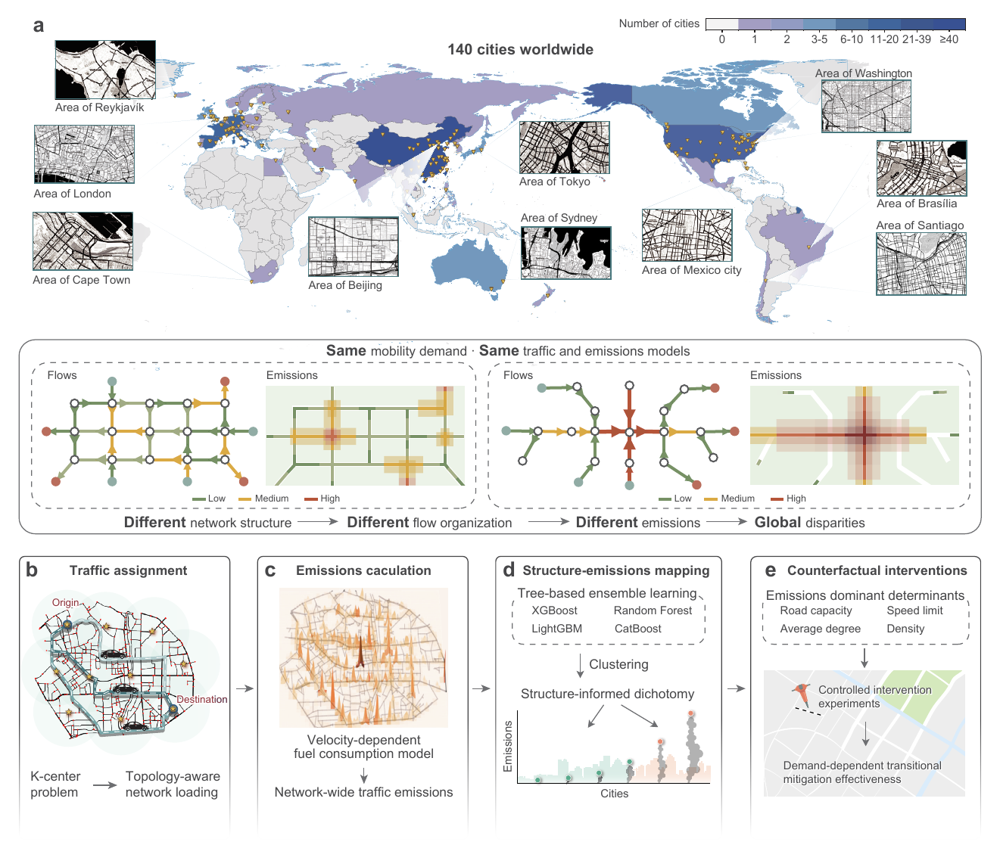
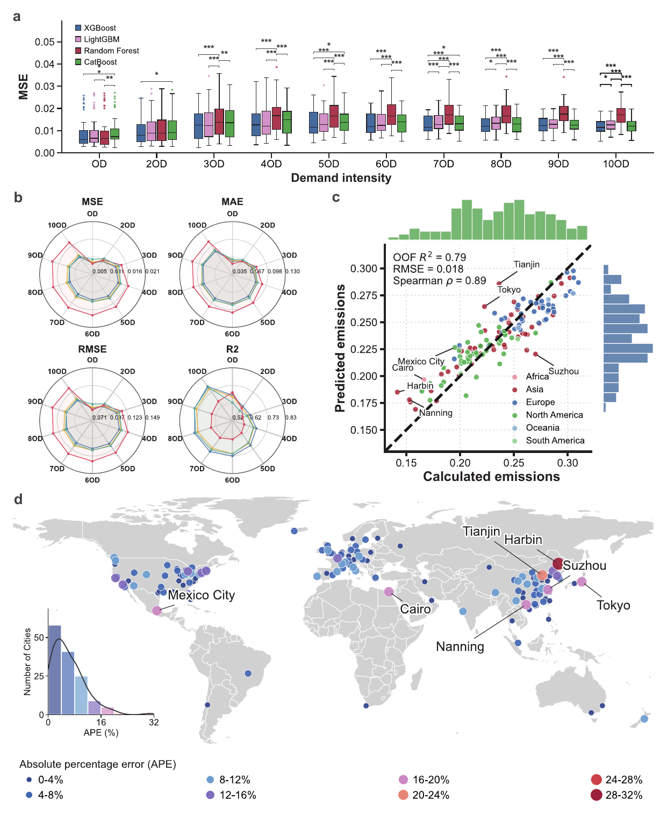
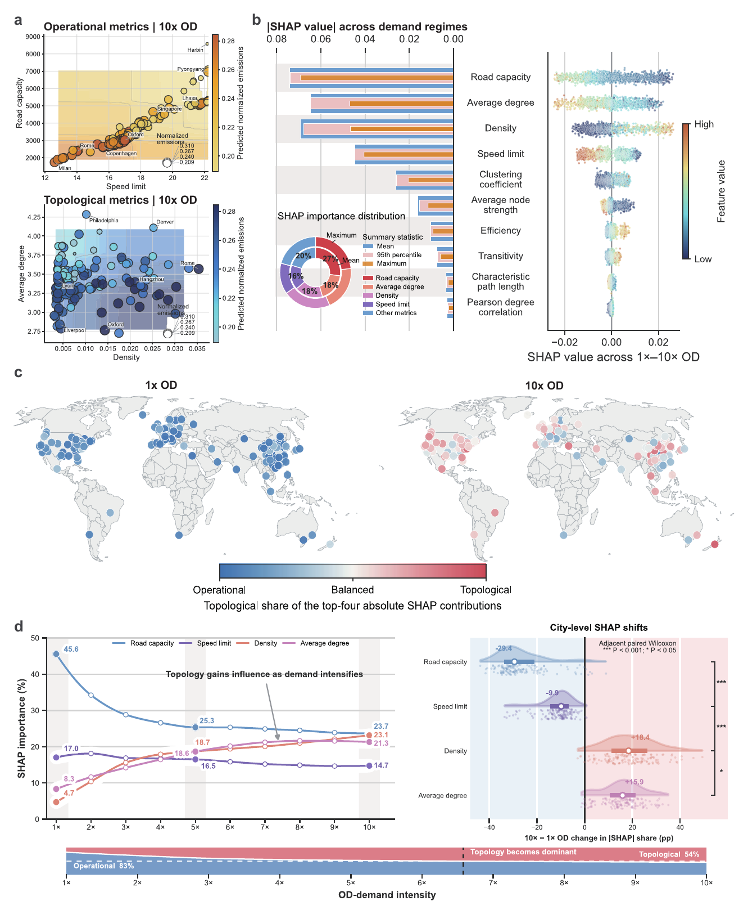
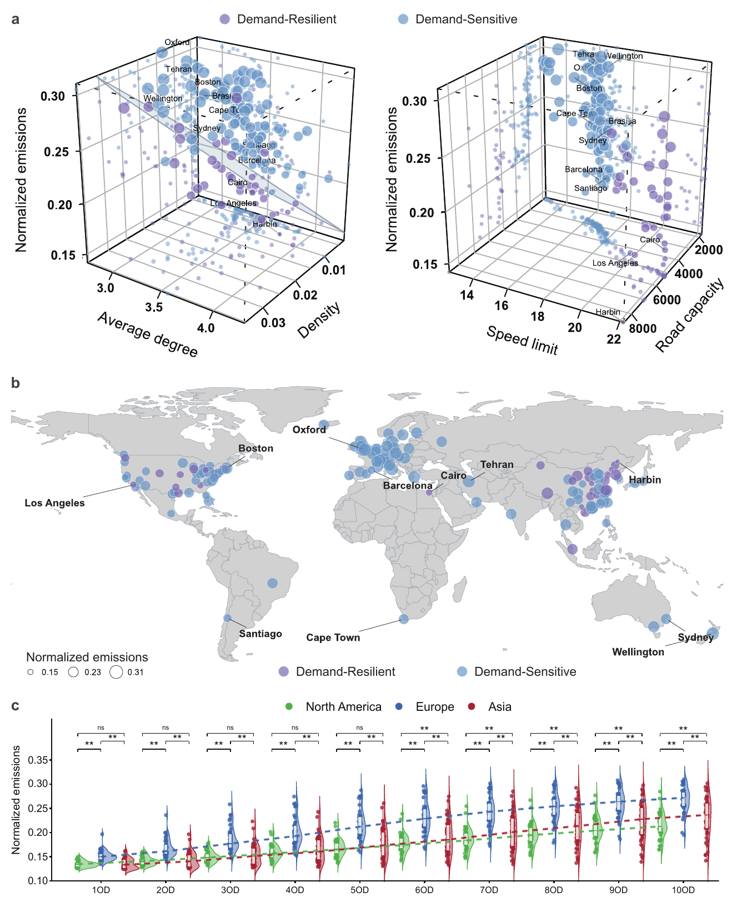
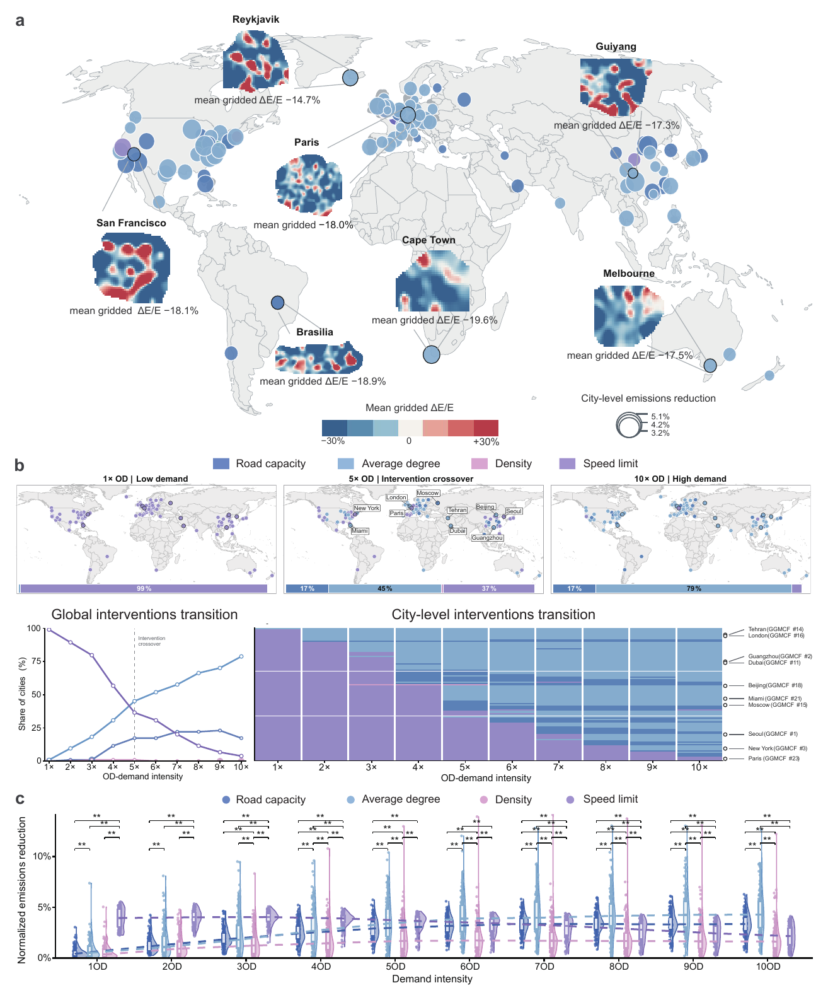
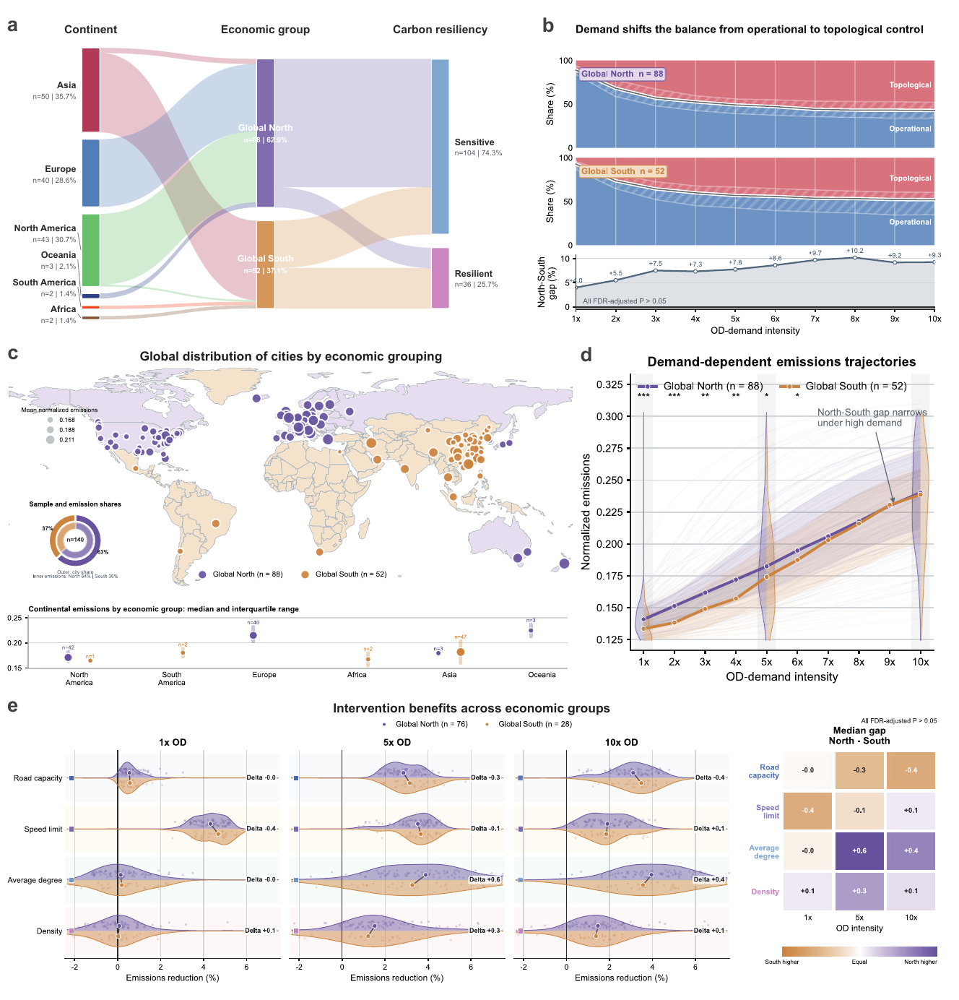
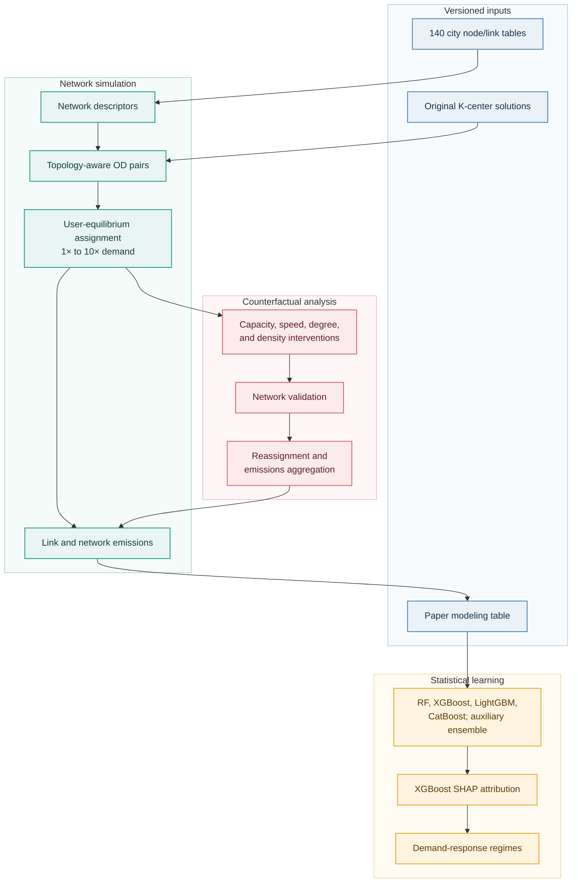
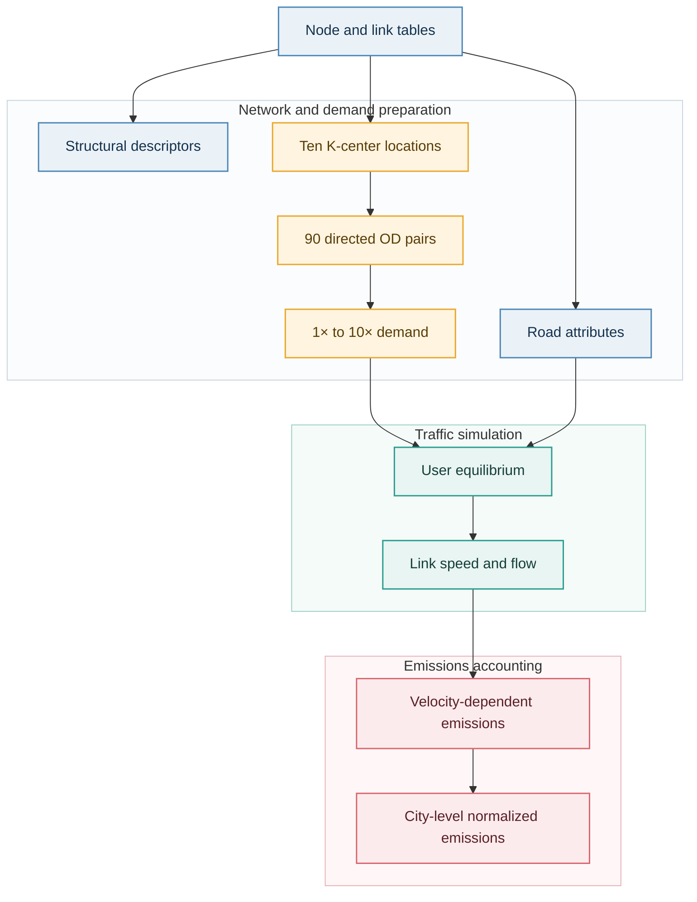
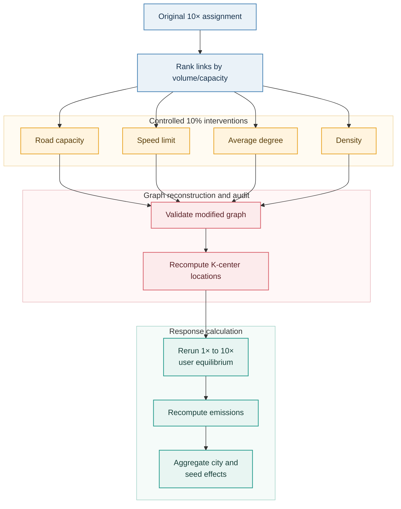

# A demand-dependent transition in network-structural mitigation of urban traffic emissions

[](https://www.python.org/)
[](https://isocpp.org/)
[](https://www.shanshu.ai/copt)
[](LICENSE)
[](https://www.openstreetmap.org/copyright)

Core computational code and versioned inputs for the PNAS submission **"A
demand-dependent transition in network-structural mitigation of urban traffic
emissions."** The study uses network traffic theory and explainable machine
learning to isolate how road-network structure shapes traffic emissions across
140 cities. It tests how the dominant determinants shift from operational
attributes under light loading to topology under congestion, identifies
demand-sensitive and demand-resilient city regimes, and evaluates the inferred
mechanism through controlled counterfactual network interventions.

This repository is intentionally focused on scientific reproduction. It
contains the analysis and simulation code used for the reported experiments,
but excludes figure styling, exploratory notebooks, temporary caches, and
unrelated development files.

## Study at a glance

<p align="center">
  
</p>

The computational design links five components:

1. **Network processing:** versioned road graphs for 140 cities and a common
   set of structural and operating descriptors.
2. **Topology-aware mobility loading:** ten spatially distributed centers,
   90 directed OD pairs, and standardized demand from 1× to 10×.
3. **Traffic and emissions:** user-equilibrium assignment followed by a
   velocity-dependent link-emissions model.
4. **Structure-emissions mapping:** four tree-based regressors, XGBoost-based
   SHAP attribution, and demand-response clustering; the workflow also exports
   an auxiliary voting ensemble for reproducibility checks.
5. **Counterfactual intervention:** controlled 10% changes in road capacity,
   speed limit, average degree, and density, followed by complete reassignment
   and emissions recalculation.

## Results in view

The principal manuscript figures trace the evidence from predictive validation
to mechanism, city typology, intervention response, and distributional
differences. Together they provide the empirical context for the reproducible
workflows documented below.

### Figure 2 | Structure-emissions mapping

Four tree-based models maintained positive held-out predictive performance
across all ten demand levels, with XGBoost providing the strongest overall
performance. Each model-demand combination was evaluated over 50 independent
80:20 train-test splits. At 10× OD demand, out-of-fold predictions for all 140
cities reached an R2 of 0.79, an RMSE of 0.018, and a Spearman correlation of
0.89. The global error map shows that larger errors were dispersed rather than
confined to one region.

<p align="center">
  
</p>

### Figure 3 | Demand-dependent control of emissions

XGBoost-based SHAP attribution identified road capacity, average degree,
density, and speed limit as the four leading determinants, together accounting
for nearly 80% of explanatory importance. Their relative influence changed
systematically with demand: operational constraints dominated under light
loading, whereas average degree and density gained influence as congestion
intensified. City-level distributions and global maps show that this transition
was widespread but spatially heterogeneous.

<p align="center">
  
</p>

### Figure 4 | Carbon-resilience regimes

Ward hierarchical clustering of the four dominant determinants separated the
sample into 104 demand-sensitive and 36 demand-resilient cities. Both response
regimes occurred across world regions, indicating that they describe network
behavior rather than fixed geographic categories. Continental distributions
show persistently higher normalized emissions in the sampled European cities
and increasingly dispersed outcomes among Asian cities as demand rises; the
smaller samples from the other continents limit broader inference.

<p align="center">
  
</p>

### Figure 5 | Counterfactual decarbonization responses

We then tested whether the inferred feature relationships translate into lower
emissions after controlled 10% network interventions and complete traffic
reassignment. Speed-limit modification was the leading strategy for 99% of
demand-sensitive cities at 1× OD demand, but its advantage declined as
congestion increased. Average-degree modification became the leading strategy
for 45% of demand-sensitive cities at 5× demand and 79% at 10× demand,
consistent with the increasing influence of topology under heavy loading.

The local emission-change maps show that a beneficial intervention can reduce
emissions in some parts of a network while increasing them elsewhere. The net
reduction therefore reflects system-wide flow redistribution rather than a
uniform decline on every road segment.

<p align="center">
  
</p>

### Figure 6 | Conditional Global North–South disparities

The economic grouping comprised 88 Global North and 52 Global South cities.
Demand-sensitive cities were more prevalent in the Global North (86.4%) than
in the Global South (53.8%). Low-demand median emissions were higher in the
Global North, but the difference narrowed with demand and was no longer
significant from 7× OD onward. At 10× demand, the medians converged to 0.2401
and 0.2386, respectively.

Both groups shifted toward greater topological attribution as demand rose,
although their differences in topological SHAP share were not significant
after false-discovery-rate correction. Simulated intervention benefits were
also broadly comparable between the two groups. The principal differences
therefore lay in the prevalence of demand sensitivity and low-demand
emissions, rather than in intervention effectiveness.

<p align="center">
  
</p>

## Reproducibility map



Two complementary reproduction routes are provided:

| Route | Starting point | What it reproduces | Typical use |
|---|---|---|---|
| Analysis route | `data/processed/city_features_emissions.xlsx` | Model evaluation, SHAP values, and city response regimes | Fastest route for reviewing the principal statistical findings |
| End-to-end route | `network/*_node.csv` and `network/*_link.csv` | Descriptors, OD selection, traffic assignment, emissions, and interventions | Full computational audit of the simulation pipeline |

## Repository structure

```text
road-network-decarbonization/
|-- configs/                         Study configuration and stored city areas
|-- cpp/traffic_assignment/          C++14 user-equilibrium implementation
|-- data/
|   |-- processed/                   Versioned 140-city modeling table
|   `-- README.md                    Data dictionary and provenance
|-- docs/assets/                     README and documentation assets
|-- k_center/results/original/       Exact original-network center solutions
|-- network/                         Versioned node and link tables, cities 1-140
|-- scripts/                         Reproducible workflow entry points
|-- src/
|   |-- analysis/                    SHAP and response-regime analysis
|   |-- emissions/                   Emissions calculation and aggregation
|   |-- interventions/               Counterfactual network modifications
|   |-- modeling/                    Model training and evaluation
|   |-- od_selection/                K-center OD-center selection
|   `-- preprocessing/               Network construction and descriptors
|-- tests/                           Unit, schema, and numerical checks
`-- outputs/                         Generated artifacts, excluded from Git
```

## Software requirements

The workflows were tested with **Python 3.11** on Windows. Exact K-center
regeneration requires **COPT 8** and a valid local license. Traffic assignment
requires a C++14 compiler with OpenMP support; the supplied PowerShell runner
expects `g++` on `PATH`.

```powershell
git clone <repository-url>
cd road-network-decarbonization

python -m venv .venv
.venv\Scripts\Activate.ps1
python -m pip install --upgrade pip
python -m pip install -r requirements.txt
python -m pip install -e .
python scripts\verify_inputs.py
```

The package versions used for the paper are pinned in `requirements.txt`. The
traffic-assignment executables are compiled by the runner with
`-O2 -DNDEBUG -fopenmp`.

## Quick start

### 1. Validate the installation

```powershell
python -m unittest discover -s tests -v
powershell -ExecutionPolicy Bypass -File scripts\run_analysis.ps1 -SmokeTest
```

The smoke test confirms the environment and data contracts. It does not
reproduce the complete reported model experiment.

### 2. Reproduce the statistical analysis

```powershell
powershell -ExecutionPolicy Bypass -File scripts\run_analysis.ps1
```

The full analysis evaluates ten demand levels and 50 deterministic train/test
splits. For every split it tunes four tree-based regressors with 30 randomized
search draws and leave-one-out cross-validation. XGBoost is retained for the
reported SHAP interpretation; the workflow also constructs an auxiliary voting
ensemble from the three best cross-validated models in each split.

Principal outputs:

```text
outputs/modeling/test_metrics.csv
outputs/models/*.joblib
outputs/shap/shap_values_*.csv
outputs/shap/global_feature_importance.csv
outputs/clustering/city_response_regimes.csv
```

Random states, predictor names, target columns, and demand levels are explicit
in `src/modeling/train_models.py`. The paper used each estimator library's
default threading behavior. `--estimator-jobs 1` is available for constrained
systems; XGBoost and the voting ensemble may show small hardware-dependent
floating-point differences under a different thread count.

### 3. Reproduce the original-network pipeline

Start with one city as an end-to-end installation test:

```powershell
powershell -ExecutionPolicy Bypass -File scripts\run_full_pipeline.ps1 `
  -CityIds 1 `
  -MaxWorkers 1
```

Run all 140 cities:

```powershell
powershell -ExecutionPolicy Bypass -File scripts\run_full_pipeline.ps1 `
  -MaxWorkers 8
```



Network descriptors follow the definitions documented in `data/README.md` and
are linked to the versioned 140-city modeling table used by the analysis route.

The repository includes the exact original-network K-center solutions used in
the study. To regenerate them, configure a valid COPT license and remove the
corresponding result CSV files or omit `--skip-existing`.

Live OpenStreetMap retrieval is optional and is not recommended for exact
numerical reproduction because the source database changes over time. Selected
networks can be rebuilt from the stored areas with:

```powershell
python -m src.preprocessing.build_networks --city-ids 1,2
```

### 4. Reproduce the counterfactual interventions

The original-network pipeline must run first because interventions rank links
using the original 10×-demand volume-to-capacity ratio.

One-city, one-seed audit:

```powershell
powershell -ExecutionPolicy Bypass -File scripts\run_counterfactuals.ps1 `
  -CityIds 1 `
  -ExperimentGroups neighbor_seed_01 `
  -ChangeRatio 0.10 `
  -MaxWorkers 4
```

Complete experiment:

```powershell
powershell -ExecutionPolicy Bypass -File scripts\run_counterfactuals.ps1 `
  -ChangeRatio 0.10 `
  -MaxWorkers 8
```



The network reconstruction is a controlled counterfactual experiment designed
to test the inferred topology-emissions relationships. It is not a detailed
street-engineering proposal: real projects require geometric feasibility,
right-of-way, safety, land-use, cost, and governance constraints beyond the
scope of this experiment.

## Method-to-code index

| Manuscript component | Primary implementation | Main output |
|---|---|---|
| Road-network construction and attributes | `src/preprocessing/build_networks.py` | `network/<city>-original_*.csv` |
| Network descriptors | `src/preprocessing/topology_metrics.py` | `outputs/network_descriptors.csv` |
| Topology-aware OD centers | `src/od_selection/run_k_center.py` | `k_center/results/**/*.csv` |
| User-equilibrium assignment | `cpp/traffic_assignment/user_equilibrium.cpp` | `flow/**/<city>_flow.csv` |
| Velocity-dependent emissions | `src/emissions/compute_emissions.py` | `outputs/emissions/**` |
| Four regressors and auxiliary voting ensemble | `src/modeling/train_models.py` | `outputs/modeling/`, `outputs/models/` |
| XGBoost SHAP attribution | `src/analysis/compute_shap.py` | `outputs/shap/` |
| Demand-response regimes | `src/analysis/cluster_cities.py` | `outputs/clustering/` |
| Counterfactual network interventions | `src/interventions/run_interventions.py` | `revised_network/neighbor_seed_*/` |
| Intervention consistency checks | `src/interventions/validate_networks.py` | Console validation report |
| Intervention effect aggregation | `src/emissions/aggregate_interventions.py` | `outputs/carbon_reduction_analysis_neighbor_summary.xlsx` |

## Reproducibility boundaries

- **Versioned inputs:** all 140 original node/link pairs, the exact original
  K-center solutions, and the 140-city modeling table are included.
- **Generated artifacts:** flow tables, fitted estimators, SHAP arrays,
  modified networks, and emissions outputs are regenerated and ignored by Git.
- **Storage:** a complete run can create more than 18 GB of intermediate files.
- **Determinism:** network intervention seeds, model splits, and clustering
  settings are fixed in code. Multithreaded estimator reductions can introduce
  small platform-level floating-point variation.
- **External solver:** original-network results can be reproduced downstream
  from the versioned centers without COPT. Regenerating exact centers for new
  or modified graphs requires a valid COPT license.

## Data provenance and licenses

See [`data/README.md`](data/README.md) for the input schema, provenance,
checksums, and generated-data policy.

- Source code is released under the [MIT License](LICENSE).
- OpenStreetMap-derived network data are subject to the Open Database License.
  Any reuse must retain attribution to OpenStreetMap contributors.
- Third-party Python packages and COPT remain subject to their own licenses.

## Citation

This repository accompanies the PNAS submission **"A demand-dependent
transition in network-structural mitigation of urban traffic emissions."** A
complete `CITATION.cff` should be created after the journal publication year,
DOI, and archival repository metadata have been assigned.

For questions about the computational workflow, open a GitHub issue with the
command used, operating system, Python version, and the relevant log excerpt.
