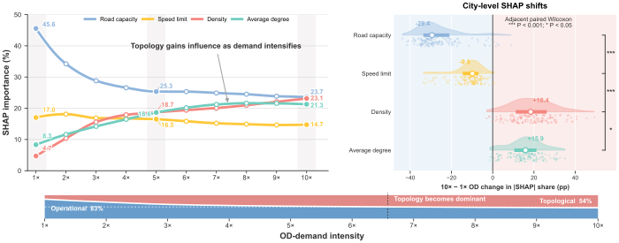
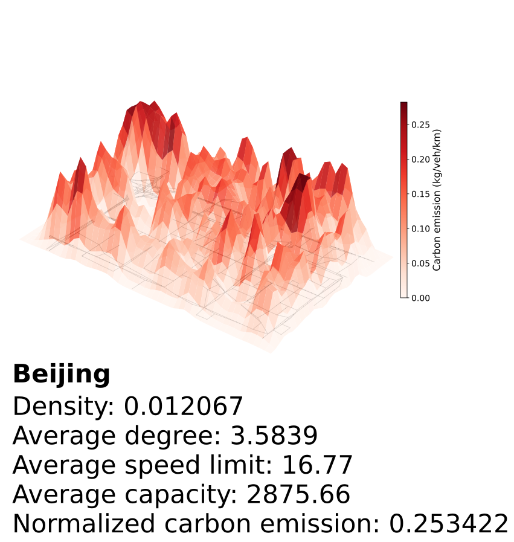
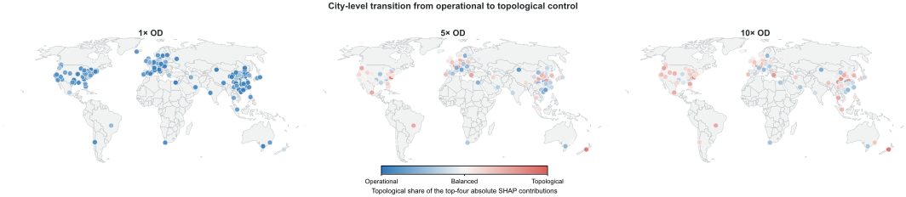
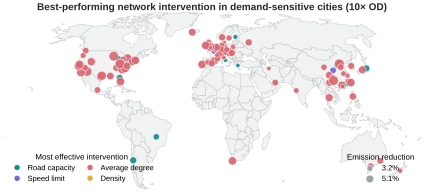
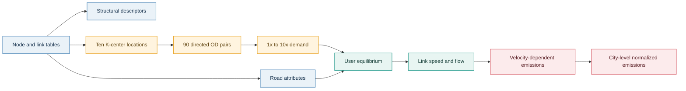
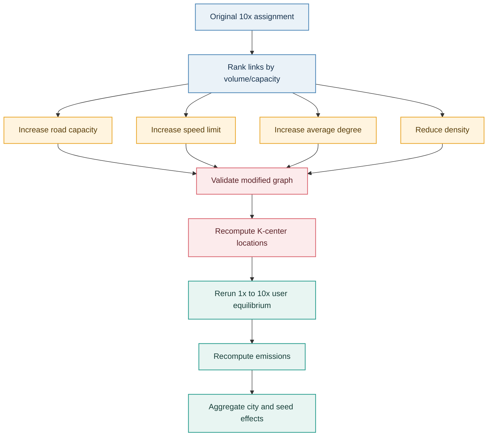

# Network Topology Predicts Urban Mobility Decarbonization Potential

[](https://www.python.org/)
[](https://isocpp.org/)
[](https://www.shanshu.ai/copt)
[](LICENSE)
[](https://www.openstreetmap.org/copyright)

Core computational code and versioned inputs for the manuscript **"Network
Topology Predicts Urban Mobility Decarbonization Potential of Global Cities."**
The study examines how road-network structure and operating conditions shape
transport emissions across 140 cities, how those relationships change from
free-flow to congested demand regimes, and whether controlled network
interventions reproduce the inferred decarbonization responses.

This repository is intentionally focused on scientific reproduction. It
contains the analysis and simulation code used for the reported experiments,
but excludes figure styling, exploratory notebooks, temporary caches, and
unrelated development files.

## Study at a glance

<p align="center">
  
</p>

The computational design links five components:

1. **Network processing:** versioned road graphs for 140 cities and a common
   set of structural and operating descriptors.
2. **Topology-aware mobility loading:** ten spatially distributed centers,
   90 directed OD pairs, and standardized demand from 1x to 10x.
3. **Traffic and emissions:** user-equilibrium assignment followed by a
   velocity-dependent link-emissions model.
4. **Topology-emissions discovery:** four tree-based regressors, a voting
   ensemble, SHAP attribution, and demand-response clustering.
5. **Counterfactual intervention:** controlled 10% changes in road capacity,
   speed limit, average degree, and density, followed by complete reassignment
   and emissions recalculation.

## Results in view

The visual evidence follows the same progression as the computational
workflow: local network loading produces heterogeneous emission surfaces,
demand shifts the balance of influential network features, and controlled
interventions reveal geographically differentiated decarbonization potential.

<p align="center">
  
</p>

<table>
  <tr>
    <td width="42%"><strong>Local emission landscape</strong></td>
    <td width="58%"><strong>Global demand transition</strong></td>
  </tr>
  <tr>
    <td></td>
    <td></td>
  </tr>
  <tr>
    <td>Link-level assignment and speed patterns form a spatially uneven
    three-dimensional emissions surface.</td>
    <td>Across 140 cities, increasing OD demand progressively changes the
    relative contribution of operational and topological controls.</td>
  </tr>
</table>

<p align="center">
  
</p>

<p align="center"><em>Counterfactual experiments translate the discovered
feature relationships into city-level intervention responses under 10x OD
demand.</em></p>

## Reproducibility map

```mermaid
flowchart LR
    subgraph INPUT[Versioned inputs]
        N["140 city node/link tables"]
        K["Original K-center solutions"]
        P["Paper modeling table"]
    end

    subgraph NETWORK[Network simulation]
        T["Network descriptors"]
        O["Topology-aware OD pairs"]
        U["User-equilibrium assignment<br/>1x to 10x demand"]
        E["Link and network emissions"]
    end

    subgraph DISCOVERY[Statistical learning]
        M["RF, XGBoost, LightGBM,<br/>CatBoost, voting ensemble"]
        S["SHAP attribution"]
        C["Demand-response regimes"]
    end

    subgraph INTERVENTION[Counterfactual analysis]
        R["Capacity, speed, degree,<br/>and density interventions"]
        V["Network validation"]
        A["Reassignment and<br/>emissions aggregation"]
    end

    N --> T --> O --> U --> E
    K --> O
    P --> M --> S --> C
    E --> P
    U --> R --> V --> A
    A --> E

    classDef input fill:#EAF2F8,stroke:#4C86B7,color:#17324D,stroke-width:1.5px;
    classDef simulation fill:#E8F5F2,stroke:#2A9D8F,color:#163E38,stroke-width:1.5px;
    classDef learning fill:#FFF4DF,stroke:#E9A72C,color:#593D08,stroke-width:1.5px;
    classDef intervention fill:#FCEBEC,stroke:#D96570,color:#5A2026,stroke-width:1.5px;
    class N,K,P input;
    class T,O,U,E simulation;
    class M,S,C learning;
    class R,V,A intervention;
    style INPUT fill:#F8FBFD,stroke:#A9C4D8,stroke-width:1px
    style NETWORK fill:#F5FBF9,stroke:#9CCFC4,stroke-width:1px
    style DISCOVERY fill:#FFFBF2,stroke:#EED39B,stroke-width:1px
    style INTERVENTION fill:#FFF7F7,stroke:#E6B2B7,stroke-width:1px
```



Two complementary reproduction routes are provided:

| Route | Starting point | What it reproduces | Typical use |
|---|---|---|---|
| Analysis route | `data/processed/city_features_emissions.xlsx` | Model evaluation, SHAP values, and city response regimes | Fastest route for reviewing the principal statistical findings |
| End-to-end route | `network/*_node.csv` and `network/*_link.csv` | Descriptors, OD selection, traffic assignment, emissions, and interventions | Full computational audit of the simulation pipeline |

## Repository structure

```text
road-network-decarbonization/
|-- configs/                         Study configuration and stored city areas
|-- cpp/traffic_assignment/          C++14 user-equilibrium implementation
|-- data/
|   |-- processed/                   Versioned 140-city modeling table
|   `-- README.md                    Data dictionary and provenance
|-- docs/assets/                     README and documentation assets
|-- k_center/results/original/       Exact original-network center solutions
|-- network/                         Versioned node and link tables, cities 1-140
|-- scripts/                         Reproducible workflow entry points
|-- src/
|   |-- analysis/                    SHAP and response-regime analysis
|   |-- emissions/                   Emissions calculation and aggregation
|   |-- interventions/               Counterfactual network modifications
|   |-- modeling/                    Model training and evaluation
|   |-- od_selection/                K-center OD-center selection
|   `-- preprocessing/               Network construction and descriptors
|-- tests/                           Unit, schema, and numerical checks
`-- outputs/                         Generated artifacts, excluded from Git
```

## Software requirements

The workflows were tested with **Python 3.11** on Windows. Exact K-center
regeneration requires **COPT 8** and a valid local license. Traffic assignment
requires a C++14 compiler with OpenMP support; the supplied PowerShell runner
expects `g++` on `PATH`.

```powershell
git clone <repository-url>
cd road-network-decarbonization

python -m venv .venv
.venv\Scripts\Activate.ps1
python -m pip install --upgrade pip
python -m pip install -r requirements.txt
python -m pip install -e .
python scripts\verify_inputs.py
```

The package versions used for the paper are pinned in `requirements.txt`. The
traffic-assignment executables are compiled by the runner with
`-O2 -DNDEBUG -fopenmp`.

## Quick start

### 1. Validate the installation

```powershell
python -m unittest discover -s tests -v
powershell -ExecutionPolicy Bypass -File scripts\run_analysis.ps1 -SmokeTest
```

The smoke test confirms the environment and data contracts. It does not
reproduce the complete reported model experiment.

### 2. Reproduce the statistical analysis

```powershell
powershell -ExecutionPolicy Bypass -File scripts\run_analysis.ps1
```

The full analysis evaluates ten demand levels and 50 deterministic train/test
splits. For every split it tunes four tree-based regressors with 30 randomized
search draws and leave-one-out cross-validation, then constructs the voting
ensemble used for attribution.

Principal outputs:

```text
outputs/modeling/test_metrics.csv
outputs/models/*.joblib
outputs/shap/shap_values_*.csv
outputs/shap/global_feature_importance.csv
outputs/clustering/city_response_regimes.csv
```

Random states, predictor names, target columns, and demand levels are explicit
in `src/modeling/train_models.py`. The paper used each estimator library's
default threading behavior. `--estimator-jobs 1` is available for constrained
systems; XGBoost and the voting ensemble may show small hardware-dependent
floating-point differences under a different thread count.

### 3. Reproduce the original-network pipeline

Start with one city as an end-to-end installation test:

```powershell
powershell -ExecutionPolicy Bypass -File scripts\run_full_pipeline.ps1 `
  -CityIds 1 `
  -MaxWorkers 1
```

Run all 140 cities:

```powershell
powershell -ExecutionPolicy Bypass -File scripts\run_full_pipeline.ps1 `
  -MaxWorkers 8
```



Network descriptors follow the definitions documented in `data/README.md` and
are linked to the versioned 140-city modeling table used by the analysis route.

The repository includes the exact original-network K-center solutions used in
the study. To regenerate them, configure a valid COPT license and remove the
corresponding result CSV files or omit `--skip-existing`.

Live OpenStreetMap retrieval is optional and is not recommended for exact
numerical reproduction because the source database changes over time. Selected
networks can be rebuilt from the stored areas with:

```powershell
python -m src.preprocessing.build_networks --city-ids 1,2
```

### 4. Reproduce the counterfactual interventions

The original-network pipeline must run first because interventions rank links
using the original 10x-demand volume-to-capacity ratio.

One-city, one-seed audit:

```powershell
powershell -ExecutionPolicy Bypass -File scripts\run_counterfactuals.ps1 `
  -CityIds 1 `
  -ExperimentGroups neighbor_seed_01 `
  -ChangeRatio 0.10 `
  -MaxWorkers 4
```

Complete experiment:

```powershell
powershell -ExecutionPolicy Bypass -File scripts\run_counterfactuals.ps1 `
  -ChangeRatio 0.10 `
  -MaxWorkers 8
```



The network reconstruction is a controlled counterfactual experiment designed
to test the inferred topology-emissions relationships. It is not a detailed
street-engineering proposal: real projects require geometric feasibility,
right-of-way, safety, land-use, cost, and governance constraints beyond the
scope of this experiment.

## Method-to-code index

| Manuscript component | Primary implementation | Main output |
|---|---|---|
| Road-network construction and attributes | `src/preprocessing/build_networks.py` | `network/<city>-original_*.csv` |
| Network descriptors | `src/preprocessing/topology_metrics.py` | `outputs/network_descriptors.csv` |
| Topology-aware OD centers | `src/od_selection/run_k_center.py` | `k_center/results/**/*.csv` |
| User-equilibrium assignment | `cpp/traffic_assignment/user_equilibrium.cpp` | `flow/**/<city>_flow.csv` |
| Velocity-dependent emissions | `src/emissions/compute_emissions.py` | `outputs/emissions/**` |
| Four regressors and voting ensemble | `src/modeling/train_models.py` | `outputs/modeling/`, `outputs/models/` |
| SHAP attribution | `src/analysis/compute_shap.py` | `outputs/shap/` |
| Demand-response regimes | `src/analysis/cluster_cities.py` | `outputs/clustering/` |
| Counterfactual network interventions | `src/interventions/run_interventions.py` | `revised_network/neighbor_seed_*/` |
| Intervention consistency checks | `src/interventions/validate_networks.py` | Console validation report |
| Intervention effect aggregation | `src/emissions/aggregate_interventions.py` | `outputs/carbon_reduction_analysis_neighbor_summary.xlsx` |

## Reproducibility boundaries

- **Versioned inputs:** all 140 original node/link pairs, the exact original
  K-center solutions, and the 140-city modeling table are included.
- **Generated artifacts:** flow tables, fitted estimators, SHAP arrays,
  modified networks, and emissions outputs are regenerated and ignored by Git.
- **Storage:** a complete run can create more than 18 GB of intermediate files.
- **Determinism:** network intervention seeds, model splits, and clustering
  settings are fixed in code. Multithreaded estimator reductions can introduce
  small platform-level floating-point variation.
- **External solver:** original-network results can be reproduced downstream
  from the versioned centers without COPT. Regenerating exact centers for new
  or modified graphs requires a valid COPT license.

## Data provenance and licenses

See [`data/README.md`](data/README.md) for the input schema, provenance,
checksums, and generated-data policy.

- Source code is released under the [MIT License](LICENSE).
- OpenStreetMap-derived network data are subject to the Open Database License.
  Any reuse must retain attribution to OpenStreetMap contributors.
- Third-party Python packages and COPT remain subject to their own licenses.

## Citation

Publication metadata have intentionally not been guessed. Before creating an
archival release, complete `CITATION.cff.template`, rename it to
`CITATION.cff`, and add the final author list, year, DOI, and repository URL.

For questions about the computational workflow, open a GitHub issue with the
command used, operating system, Python version, and the relevant log excerpt.
